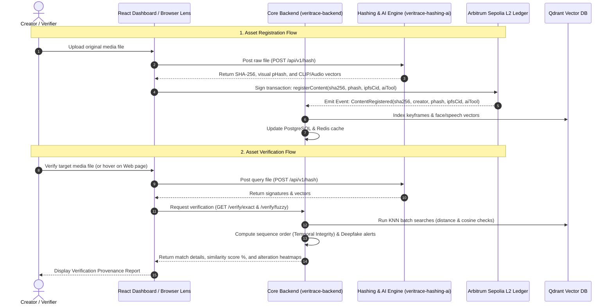

# VeriTrace: Blockchain-Backed Content Provenance for the Age of AI

Welcome to the official repository hub of **VeriTrace**, a decentralized content provenance and verification protocol. VeriTrace establishes an immutable, cryptographic chain of custody for digital media (images, videos, audio, text, and documents) to combat deepfakes, plagiarism, and metadata manipulation.

By marrying high-speed Layer-2 EVM registries with perceptual and semantic off-chain inference pipelines, VeriTrace acts as an uncompromisable "birth-certificate" system for digital files.

---

## The Core Problem

1. **Generative AI & Deepfakes**: The explosion of synthetic media makes distinguishing original photography or news from AI-generated clones nearly impossible.
2. **Metadata Stripping**: Social networks and web platforms automatically strip EXIF/IPTC metadata on upload, erasing any proof of authorship or tool attribution.
3. **Cryptographic Hashing Fragility**: Traditional hashes (like SHA-256) change completely with a 1-bit difference. A simple crop, resize, or image compression breaks the index, letting modified duplicates evade detection.
4. **Blockchain Scale Limitations**: Anchoring large files or performing fuzzy vector comparisons directly on-chain is too slow and cost-prohibitive.

---

## The VeriTrace Solution

VeriTrace splits the registry into a high-performance **Layer-2 blockchain state** and an intelligent **off-chain search and inference grid**:
- **WASM Smart Contract Registry**: Deployed on **Arbitrum Sepolia** using the high-performance **Rust Stylus SDK**, storing immutable anchors containing cryptographic SHA-256, perceptual pHash, IPFS pointers, and creator signatures at near-zero gas costs.
- **Multimodal Perceptual Hashing**: Extracts shape-invariant perceptual hashes (pHash) and Simhash signatures to recognize compressed, edited, or spliced copies.
- **Off-Chain AI Inference**: Automatically runs CLIP semantic classification, InsightFace facial geometry keypoint checks, and Wav2Vec2 speech analysis to spot deepfakes.
- **Low-Latency Retrievability**: Leverages a fast cache (PostgreSQL, Redis) and vector similarity database (Qdrant) to resolve fuzzy and exact checks in under 10ms.

---

## Repository Architecture Mapping

The VeriTrace ecosystem is structured as a decoupled multi-repository architecture. Below is the directory mapping of our active repositories:

| Repository | Tech Stack | Purpose |
| :--- | :--- | :--- |
| [**veritrace-backend**](https://github.com/VetiTrace-Lampros-Dao/veritrace-backend) | Go, Gin Gonic, PostgreSQL, Redis, Qdrant, go-ethereum | **Core Backend Orchestrator**: Collects off-chain metadata, listens to Arbitrum block events, index vectors in Qdrant, caches in Redis, and hosts the verification API. |
| [**veritrace-hashing-ai**](https://github.com/VetiTrace-Lampros-Dao/veritrace-hashing-ai) | Go, Python, FastAPI, PyTorch, FFmpeg, Poppler, LibreOffice | **Off-Chain Services Engine**: Ingests files, runs FFmpeg keyframe splitting, LibreOffice doc conversions, and executes PyTorch neural weights (CLIP, BLIP, InsightFace, Wav2Vec2) to output embeddings. |
| [**contract**](https://github.com/VetiTrace-Lampros-Dao/contract) | Rust, Arbitrum Stylus SDK, Alloy | **Blockchain Registry**: The immutable WASM smart contract registry on Arbitrum Sepolia managing registrations, verified publishers, and dataset escrow-licensing. |
| [**Veritrace-Frontend**](https://github.com/VetiTrace-Lampros-Dao/Veritrace-Frontend) | React (Vite), TailwindCSS, Wagmi, Ethers, Web3 | **Creator Dashboard**: The main client interface where content creators register original works, view detailed verification results, and manage licensing. |
| [**veritrace-extension**](https://github.com/VetiTrace-Lampros-Dao/veritrace-extension) | Chrome Extension API, JavaScript | **VeriTrace Lens**: Integrates in-page hover cards on any website, verifying images against the protocol automatically without manual upload. |
| [**Rag-Bot**](https://github.com/VetiTrace-Lampros-Dao/Rag-Bot) | Python, Sentence-Transformers | **AI Assistant Bot**: Coordinates natural-language RAG queries regarding the provenance database records. |

---

## System Architecture Flow

The sequence diagram below displays how the components coordinate to run verification:

---

## Verification Metrics & Thresholds

During segment-based searches (videos, documents), the system evaluates vectors returned by Qdrant against the following metrics:
- **Visual Perceptual Hash (pHash)**: Manhattan distance threshold of `<= 22.0` (corresponds to **`>= 65.625%`** visual shape similarity).
- **Semantic Text/Image (CLIP)**: Cosine similarity threshold of `>= 0.85` (corresponds to **`>= 85.0%`** conceptual meaning similarity).
- **Face Keypoints (InsightFace)**: Cosine similarity threshold of `>= 0.60` (corresponds to **`>= 60.0%`** face similarity).
- **Audio vocal patterns (Wav2Vec2)**: Cosine similarity threshold of `>= 0.999` (corresponds to **`>= 99.9%`** speaker identity similarity).

---

## Hackathon Judges' Step-by-Step Walkthrough

Follow this sequence to test VeriTrace:

### Step 1: Creator Registration (Immutable Archival)
1. Navigate to the **VeriTrace Creator Dashboard**.
2. Connect your Web3 Wallet (MetaMask / Coinbase Wallet) to the **Arbitrum Sepolia Testnet**.
3. Upload an original image, video, or document.
4. Sign the transaction. The smart contract commits the SHA-256 and pHash, emitting an event that indexes the asset in the backend cache and Qdrant DB.

### Step 2: In-Page Verification (Chrome Extension)
1. Install **VeriTrace Lens** (Chrome Extension).
2. Browse any webpage containing the registered image (or a slightly compressed version of it).
3. Hover over the image. The extension instantly queries the backend using the visual pHash, returning a green card certifying the original creator, timestamp, and Arbitrum transaction hash.

### Step 3: Deep Verification & Heatmap Inspection
1. Open the **Verification page** in the dashboard.
2. Upload a modified version of the original image (e.g. cropped, text added, or colors modified).
3. The system will match it, return a similarity score (e.g. `92.4%`), and display an **Alteration Heatmap** outlining the modified sections in red.

### Step 4: Audio-Video Deepfake Auditing
1. Upload a video containing swapped speech track (deepfake voice cloning).
2. The backend cross-correlates the video's lip-frame speed with the vocal RMS audio energy waves.
3. The system displays a red warning: **"CRITICAL ALERT: Audio Deepfake detected!"**, indicating the video frames are authentic but the speech has been synthetically altered.
